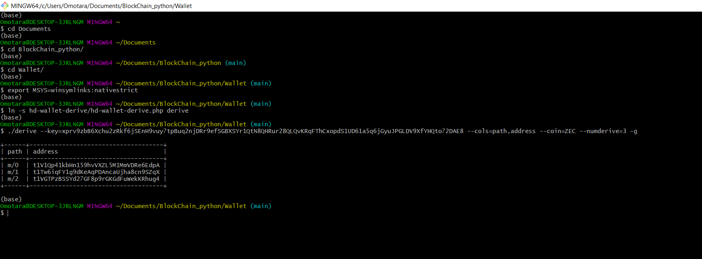
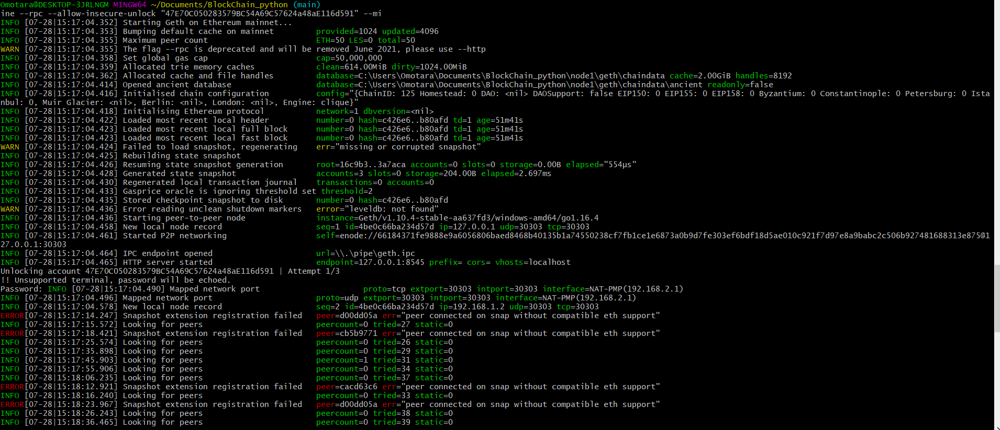

# BlockChain_python

The objective of this repository is to design a wallet that can send either testnet bitcoin or testnet ethereum crytpocurrencies to any counterpart address that meet the requirementes of the network.

In addition to that, the wallet has provisions to execute transactions with real bitcoin.

The wallet is comprised of 4 sections:

  Section 1: Installation of the right dependencies for the activity
  
  Section 2: Address derive, which includes generating 3 set of addresses for two Crypto currency Networks: Bitcoin-testnet (BTCTEST) and Ethereum (ETH).
  
  Section 3: Transactions execution along the testnet bitcoin network (btc-test).
  
  Section 4: Transaction executions along the local Ethereum Network (oyinnet)
  
 # Section 1- Installation and Project setup
 
  •	Clone the hd-wallet-derive tool into the wallet folder and install it
  
  
  
  
  
  •	Open up Git-Bash as an administrator and perform the following steps, test that you can run the ./derive script properly and the output will be as shown in the image below
  
  
  
# Section 2- Address Derive

This section consists of one function designed to generate the address, private key and public key of any cryptocurrency based on input the mnemonic phrase. the function defaults in generating 3 set of keys. 

The function named: derive_wallets in the code relies on the hd-wallet-derive library

Also, the function was used to generate the addresses and key pairs from a mnemonic phrase located in the nano .env file. Those addresses were used to operate the wallet (complete transactions). See below the addresses

 
 
  

# Section 3- Transaction with Bitcoin Testnet

The next task was to design functions that could be called to send cryptocurrencies to/from the previously generated crypto addresses (children wallets from the main mnemonic phrase).

There are three functions, which are described below:

1) priv_key_to_account: This reveals the public address based on the private key input.

2) create_tx: This prepares offline the transaction, with the inputs of: sender private key, recipient address, amount, and coin (currency). When this function runs succesfully, prints out a string with the sender address. For the BTC testnet network the output of this function is ready to broadcast, while ethereum transactions need an extra step to approval.

3) send_tx: This function essentially broadcast the transaction to the corresponding cryptocurrency network. When this function runs succesfully, it prints out a message transaction successful along with the coin and the amount of the transaction.

Below are the images of the code from the terminal and the successful funding and transfer of the BTC testnet

 
 
  
 
  
  
  

  
  
  
  
  
# Section 4- Transactions in Local Ethereum Network:

To test the wallet in the local Network with a consensus of Proof of Authority, two of the Ethereum addresses (address1 and address2) were instatiated and the following was done:

 •	Add one of the ETH addresses to the pre-allocated accounts in ebunet.json.
 
 
 
  •	Delete the geth folder in each node, then re-initialize using geth --datadir nodeX init networkname.json. This will create a new chain, and will pre-fund the new account.
  
  
  
  
  
  
  
  • Send a transaction from the pre-funded address within the wallet to another from MyCrypto, then copy the txid into MyCrypto's TX Status
  
  
  
   

  

  
  
  
  
 
